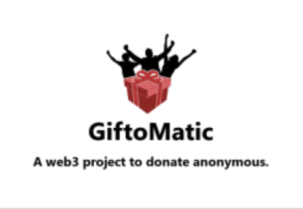

# GiftoMatic

An opensource web3 project to create donation campaigns.

The project allows people to create GiftoMatic Campaigns with a target amount and description. Then, they can generate a sharable link.

People can donate MATIC from the shared link.

## How it works?

GiftoMatic connects to the [smart contract](./contracts/Gift.sol) deployed on Polygon's Mumbai TestNet which allows to create, view campaigns and donate matic. 

React frontend deployed on [netlify](https://giftomatic.netlify.app) allows people to easily access their campaigns, donate on the platform.

## Problem it's solving

GiftoMatic solves the problem of transparency in donations and the middleman's involved in the process. The smart contract deployed on a decentralized network is immuatable and stores the records of transactions.

The amount payed using the application will be transferred to the campaign creator directly. 

Also, the application creates a transparency about a donation campaign like it's total amount deposited, address in which the amount is deposited and more.

## Running on local machine

Follow the below steps to run the project on your localnet:
- Fork the repository
- Clone the forked repository
- Run `npm install` in the project's root directory
- Update [config.js](./src/config.js) file with your own credentials. If you don't have a moralis server, create one at moralis.io. 
- Create a local ganache server and publish the [contract](./contracts/Gift.sol) from remix ide to ganache server. And add the smart contract address in config.js file.
- Run `npm start` to start the web application.

## Contributing

We welcome contributions from everyone:

(well ofcource not in Matic)

You can contribute to the project in the following way:

- Report an issue related to the project
- Add an enhancement by creating a PR
- Fixing a bug

## Todo

- Enhance the UI of the Dashboard
- Improve responsiveness on Mobile 
